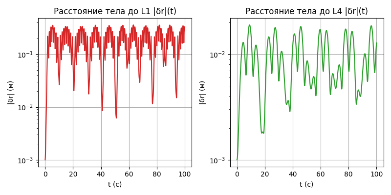

# lagrange-points

Lagrangian point stability research project using analytical method and theory and modelling with Python.

Analytical method and processing of results -- [LagrangePoints.pdf](LagrangePoints.pdf).
Sources in `LagrangePoints/`

Graphing and numerical analysis of Lagrangian points: [main.py](main.py)

Run `python main.py` or `python main.py --cli` (dependencies: `numpy matplotlib scipy tkinter`)

Graphics:
- trajectory y(x)
- phase portrait vx(x)
- distance to Lagrange point dr(t)
- Jacoby Integral C(t)
  
Animation of motion in vicinity of the Lagrange points

